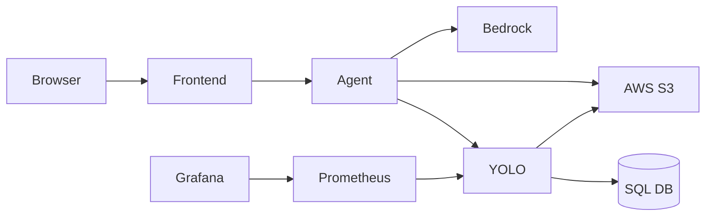

# 01 - Project Overview

PolyAI Fursa is a multi-service AI application that combines chat orchestration and image object detection.

## Core architecture

## Main technologies and why
- FastAPI: typed Python APIs with quick development.
- LangChain: tool-calling orchestration for Bedrock interactions.
- httpx: modern HTTP client for service-to-service calls.
- boto3: AWS S3 and Bedrock integration path.
- SQLAlchemy: ORM for relationship modeling and DB portability.
- React + Next.js: interactive frontend and easy deployment.
- Docker + Compose: reproducible multi-service runtime.
- Prometheus + Grafana: observability stack.

## What problem it solves
It lets users ask questions about uploaded images while keeping a clean separation between UI, language orchestration, detection inference, and monitoring.
