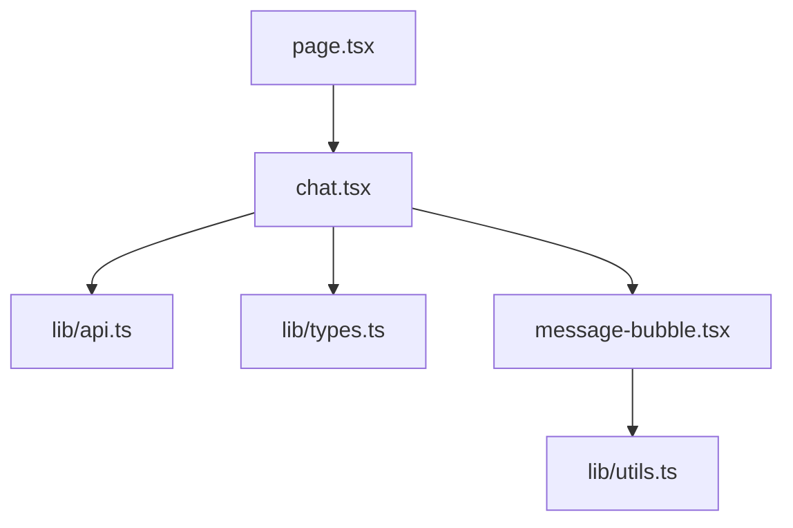

# 03 - Frontend Service

## Execution order by important files

### services/frontend/app/page.tsx
1. Imports Chat component.
2. Returns Chat as home page.

### services/frontend/components/chat.tsx
1. Initializes chat state.
2. Reads uploaded image and converts to base64.
3. Builds outgoing message payload.
4. Calls sendMessage from lib/api.ts.
5. Appends assistant response.
6. Renders message list and input controls.

### services/frontend/lib/api.ts
1. Reads NEXT_PUBLIC_AGENT_URL.
2. Sends POST /chat.
3. Parses response or throws error.

## Function map
| Function | Purpose | Called by | Params | Returns | Calls |
|---|---|---|---|---|---|
| Chat | main UI container | page.tsx | none | JSX | sendMessage |
| handleFileChange | convert file to base64 | file input event | event | void | FileReader |
| handleSubmit | send message to agent | form submit | event | Promise<void> | sendMessage |
| sendMessage | HTTP call to agent | chat.tsx | messages | ChatResponse | fetch |

## Import relationships

