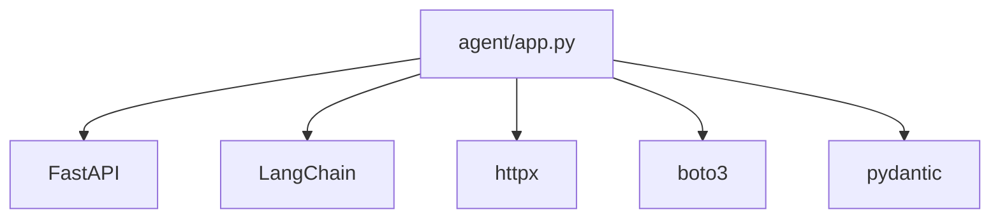
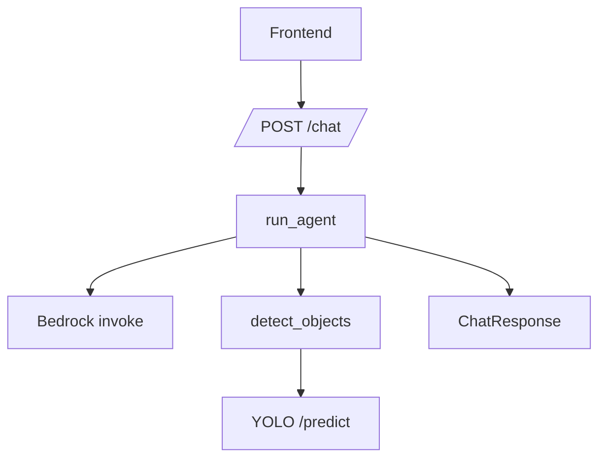

# 04 - Agent Service

## Execution order in services/agent/app.py
1. Load imports and env vars.
2. Read configuration values.
3. Define helper functions.
4. Define detect_objects tool.
5. Create tool registry.
6. Prepare rate limiter and LLM initializer.
7. Define run_agent loop.
8. Create FastAPI app and CORS.
9. Define request/response models.
10. Define /chat and /health endpoints.

## Function map (core)
| Function | Purpose | Called by | Params | Returns | Calls |
|---|---|---|---|---|---|
| detect_objects | call yolo predict pipeline | run_agent | none (ContextVar-backed) | JSON string | S3 upload, httpx POST |
| run_agent | ReAct orchestration loop | /chat | history, max_iterations | dict | LLM invoke, tool calls |
| chat | endpoint adapter | frontend | ChatRequest | ChatResponse | run_agent |
| health | liveness endpoint | deploy checks | none | status dict | none |

## Import relationships

## Call graph

