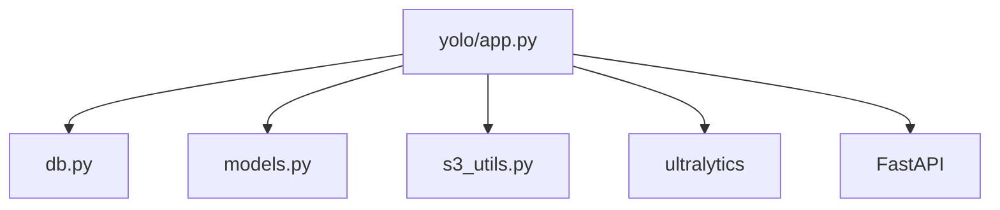

# 05 - YOLO Service

## Execution order in services/yolo/app.py
1. Import libs and internal modules.
2. Create FastAPI app.
3. Enable /metrics instrumentation.
4. Read threshold/env values.
5. Ensure upload directories exist.
6. Load YOLO model.
7. Define helper functions.
8. Define API endpoints.

## Function map (core)
| Function | Purpose | Called by | Params | Returns | Calls |
|---|---|---|---|---|---|
| predict | detection pipeline | agent/tool or clients | PredictRequest | PredictResponse | S3 download/upload, ORM writes |
| get_prediction_by_uid | return one prediction | clients | uid | dict | ORM query |
| get_prediction_image | return annotated image | agent/clients | uid | FileResponse | local file/S3 fallback |
| get_predictions_by_score | threshold filter | clients | min_score | list | ORM query |
| get_predictions_by_label | label filter | clients | label | list | ORM query |

## Import relationships

## db.py and s3_utils.py function map
- get_database_url: chooses sqlite/postgres URL.
- get_db: yields request-scoped DB session.
- upload_file_to_s3/download_file_from_s3: storage transfer utilities.
