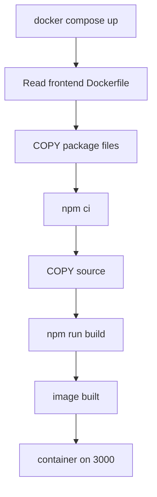
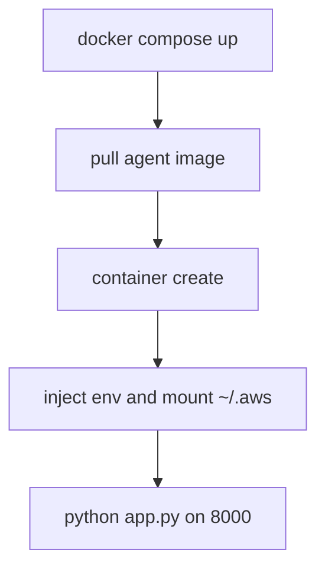
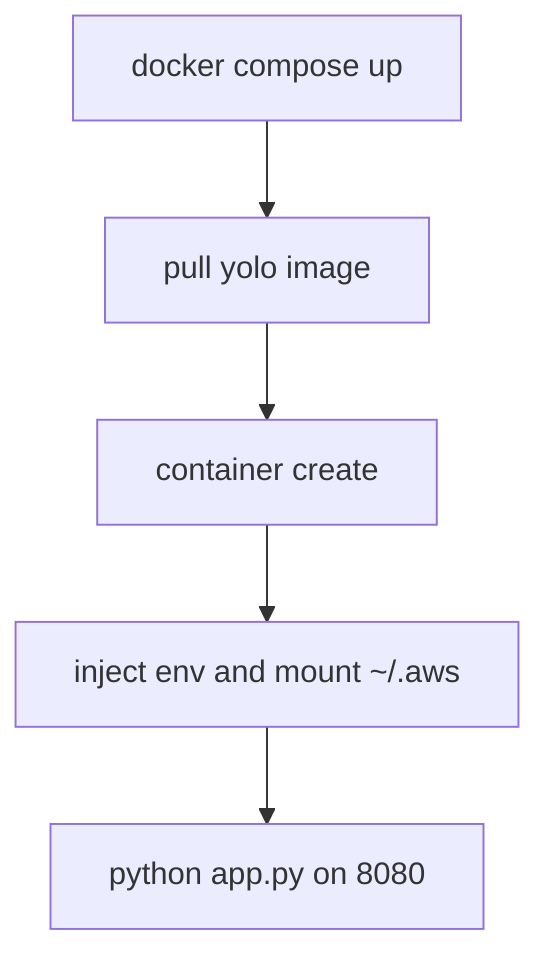

# 06 - Docker

## Build pipeline by service

### Frontend

### Agent

### YOLO

## Docker concepts in this repo
- Image: packaged runtime artifact.
- Container: running service instance.
- Build arg: NEXT_PUBLIC_AGENT_URL for frontend build.
- Env vars: runtime wiring for agent/yolo.
- Volume mounts: ~/.aws credentials and named storage.
- Networks: polyai-net and monitoring-net.
