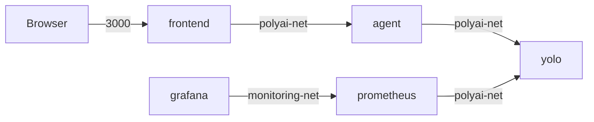

# 07 - Docker Compose

## Service wiring
- frontend -> agent via NEXT_PUBLIC_AGENT_URL.
- agent -> yolo via YOLO_SERVICE_URL=http://yolo:8080.
- prometheus -> yolo via scrape target yolo:8080.
- grafana -> prometheus via monitoring network.

## Network explanation

## Why Docker DNS works
Compose injects service-name DNS entries inside each network.
- yolo resolves to yolo container IP on polyai-net.
- agent resolves similarly.

## Startup sequence
1. Parse compose file.
2. Create networks and volumes.
3. Pull/build images.
4. Create containers.
5. Start in depends_on order.
6. Services become reachable by mapped host ports.
