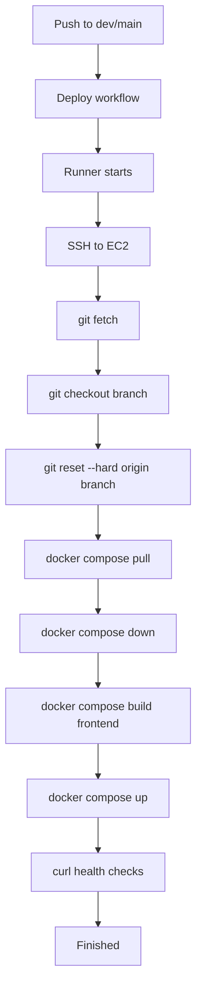
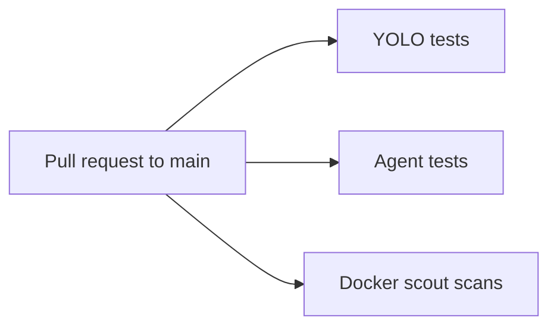

# 08 - GitHub Actions

## Deploy visual flow

## Why each step
- fetch/checkout/reset: deterministic server code state.
- pull/down/build/up: fresh runtime and rebuilt frontend config.
- health checks: ensure real readiness before success.

## Test workflow visual

