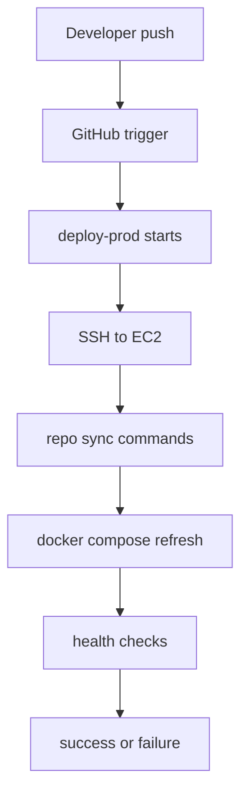

# 09 - Deployment

## Timeline after git push origin main

## Command purpose summary
- git fetch: update remote references.
- git checkout: select branch.
- git reset --hard: exact branch state.
- compose pull: update images.
- compose build frontend: bake URL config.
- compose up: run target services.
