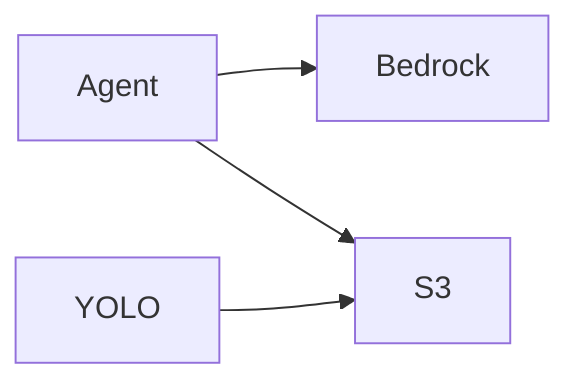

# 10 - AWS

## Services and ownership
- Agent uses Bedrock and S3.
- YOLO uses S3.
- Deployment targets EC2 instances via SSH workflow.

## Key environment variables
- AWS_REGION
- AWS_S3_BUCKET
- MODEL (agent Bedrock model id)

## Credential flow
- host ~/.aws is mounted read-only into agent and yolo containers.
- boto3 reads credentials from mounted path.

## Data flow

