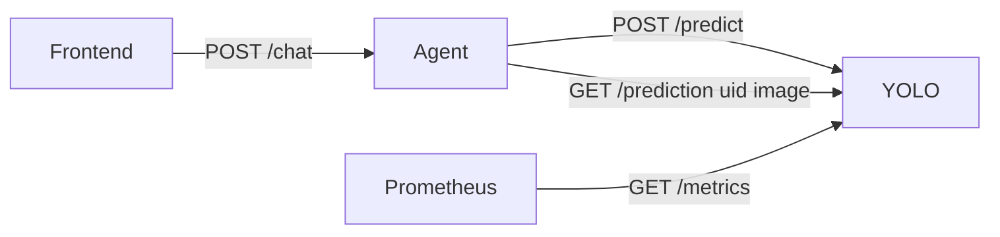
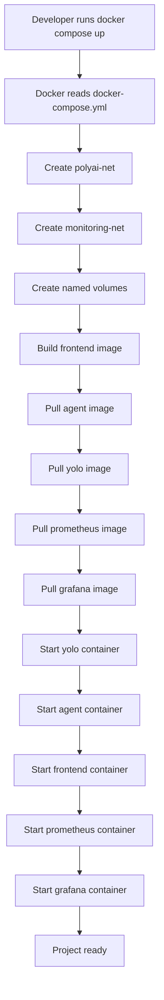
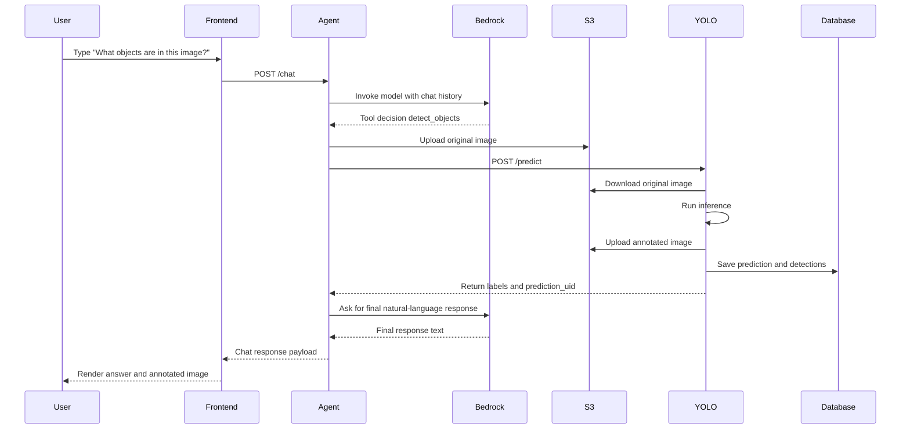
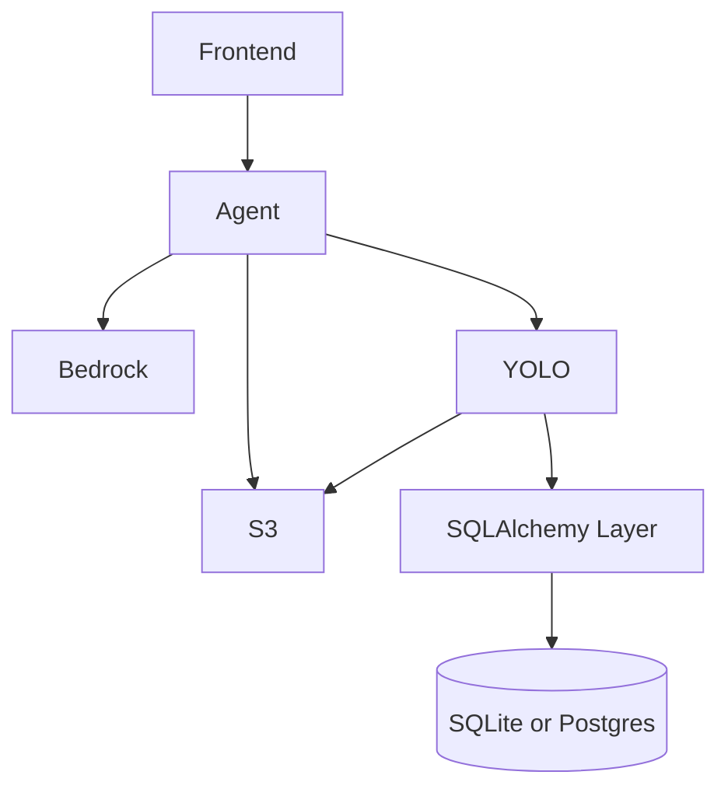

# 13 - API Reference

## Agent API (services/agent/app.py)

### POST /chat
- Purpose: primary chat endpoint.
- Called by: frontend lib/api.ts.
- Input body:
  - messages: list of { role, content, image_base64? }
  - chat_id: optional string
- Output body:
  - response
  - prediction_id
  - annotated_image
  - agent_loop_time_s
  - iterations
  - tools_called
  - context_limit_exceeded
  - tokens_used { input, output, total }
- Status codes:
  - 200 success
  - 422 validation failure

Example:
```bash
curl -X POST http://localhost:8000/chat \
  -H "Content-Type: application/json" \
  -d '{"messages":[{"role":"user","content":"What do you see?"}]}'
```

### GET /health
- Purpose: liveness check.
- Called by: deployment health checks and operators.
- Output: {"status":"ok"}

Example:
```bash
curl http://localhost:8000/health
```

## YOLO API (services/yolo/app.py)

### GET /health
- Purpose: liveness check.
- Output: {"status":"ok"}

### GET /RINA
- Purpose: utility endpoint used in tests.
- Output: {"status":"ok"}

### GET /ready
- Purpose: readiness check.
- Output:
  - 200 {"status":"ready"}
  - 503 when shutdown flag is active

### POST /predict
- Purpose: run object detection from S3 key.
- Called by: agent detect_objects tool.
- Input body:
  - image_s3_key
  - prediction_id
- Output body:
  - prediction_uid
  - detection_count
  - labels
  - time_took
- Status codes:
  - 200 success
  - 400 validation issues
  - 502 S3 transfer error
  - 503 S3 configuration error

Example:
```bash
curl -X POST http://localhost:8080/predict \
  -H "Content-Type: application/json" \
  -d '{"image_s3_key":"chat/demo/original/beatles.jpeg","prediction_id":"demo-1"}'
```

### GET /prediction/{uid}
- Purpose: retrieve one prediction and detections.
- Output: prediction metadata and detection_objects list.
- Status:
  - 200 found
  - 404 not found

### GET /prediction/{uid}/image
- Purpose: return annotated image bytes.
- Called by: agent when building chat response.
- Status:
  - 200 image
  - 404 image/prediction missing
  - 503 S3 config issue

### GET /predictions/score/{min_score}
- Purpose: list detection objects with score >= min_score.
- Status:
  - 200 list
  - 400 invalid score range

### GET /predictions/label/
- Purpose: explicit empty-label rejection.
- Status:
  - 400

### GET /predictions/label/{label}
- Purpose: list predictions containing specific label.
- Status:
  - 200 list
  - 400 invalid empty/whitespace label

### GET /metrics
- Purpose: Prometheus scrape endpoint.
- Called by: Prometheus service.

## API dependency map


## How the project starts

When a developer runs docker compose up, startup happens in this order:



Notes:
- depends_on controls start ordering, not readiness.
- readiness is checked in deployment workflow with curl loops.

## Journey of a request

This is the main flow to understand the repository:



## Why this architecture

| Component | Why it exists |
|---|---|
| Frontend | Separates UI concerns from backend orchestration and cloud dependencies |
| Agent | Centralizes LLM conversation logic and tool-calling flow |
| YOLO | Isolates computer vision workload and allows independent scaling |
| S3 | Durable storage for original and predicted images |
| SQLAlchemy | Keeps database layer maintainable and backend-portable |
| Docker | Consistent runtime across local/dev/prod |
| Docker Compose | Simple multi-service orchestration with shared networks |
| GitHub Actions | Automatic CI/CD and branch-based deployment |
| Prometheus | Automatic metrics collection from services |
| Grafana | Fast visualization and operational dashboards |

## If this service fails

| Failure | Immediate impact | What still works | First check |
|---|---|---|---|
| Frontend down | Website unavailable | Agent/YOLO APIs may still run | docker compose logs frontend |
| Agent down | Chat API unavailable | Frontend static shell might open | docker compose logs agent |
| YOLO down | Image analysis fails | Text-only chat may still respond | docker compose logs yolo |
| S3 unavailable | Image upload/download fails | Non-image chat can still work | agent/yolo logs for S3 errors |
| Bedrock unavailable | Agent cannot produce model response | YOLO may still be healthy | agent logs and model config |
| Prometheus down | No metrics scraping | Core app may still run | docker compose logs prometheus |
| Grafana down | No dashboards | Prometheus may still collect data | docker compose logs grafana |

## Complete dependency diagram



## How to debug (what to run and when)

| Problem | When to use | Command |
|---|---|---|
| Website not opening | Browser cannot load UI | docker compose ps |
| Frontend container issue | UI errors or blank page | docker compose logs frontend |
| Backend chat error | /chat returns error | docker compose logs agent |
| YOLO not responding | image flow fails | curl http://localhost:8080/health |
| Agent not healthy | frontend cannot chat | curl http://localhost:8000/health |
| Monitoring empty | dashboards have no data | curl http://localhost:8080/metrics |
| Database suspicion | missing prediction records | inspect services/yolo/predictions.db |
| Deployment failed | push triggered failed rollout | check GitHub Actions workflow logs |
| AWS auth issue | S3/Bedrock failures in logs | verify ~/.aws mount and credentials |

Recommended quick triage sequence:
1. docker compose ps
2. docker compose logs -f agent yolo frontend
3. curl health endpoints
4. verify environment variables and ~/.aws mount

## How to explain this project in 2 minutes

PolyAI Fursa is a multi-service AI system where a user chats in a web app and can upload an image for analysis. The frontend sends requests to an agent service. The agent talks to Bedrock for language reasoning and calls a YOLO microservice when object detection is needed. Images are stored in S3, while YOLO prediction metadata is saved through SQLAlchemy in a SQL database. The system is containerized with Docker Compose, deployed automatically with GitHub Actions over SSH to EC2, and monitored with Prometheus and Grafana. The architecture is split so each concern can evolve independently: UI, orchestration, vision inference, storage, and observability.
