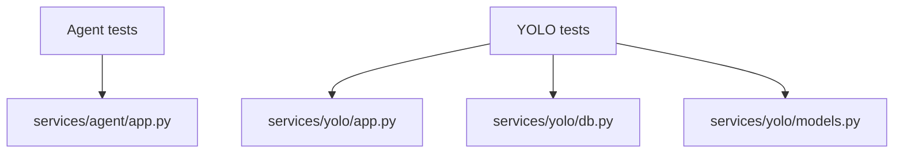

# 14 - Tests Explained

## Why tests exist in this project
Tests enforce API contracts and protect behavior during refactors.

## Agent tests

### services/agent/tests/test_api.py
- test_health_returns_ok
  - verifies /health endpoint status and payload.
- test_chat_returns_structured_response_from_mocked_run_agent
  - verifies /chat response schema from mocked core logic.
- test_chat_rejects_invalid_request_shape
  - ensures invalid request bodies return validation error 422.

### services/agent/tests/test_structured_chat.py
- run_agent returns response without tools.
- run_agent extracts prediction_id and annotated image when tool called.
- run_agent max iteration fallback behavior.
- run_agent handles invalid tool JSON safely.
- sanitization tests remove thinking blocks and inline image markdown.
- metadata extraction and model-profile validation behavior.
- detect_objects S3 upload + yolo JSON payload shape contract.

Why these tests matter:
- protect orchestration loop correctness,
- protect tool integration contract,
- prevent sensitive or unwanted model output leakage patterns.

## YOLO tests

### services/yolo/tests/test_api.py
Covers:
- /health and /RINA success,
- /ready behavior during normal and shutdown states,
- /predict input validation and success contract,
- /prediction retrieval and not-found paths,
- /prediction/{uid}/image retrieval and failures,
- S3 runtime/config error translation to 502/503.

### services/yolo/tests/test_prediction_time.py
- verifies predict includes time_took and value is numeric/non-negative.

### services/yolo/tests/test_predictions_by_label.py
- verifies existing label returns data,
- missing label returns empty list,
- empty/whitespace label returns 400.

### services/yolo/tests/test_predictions_by_score.py
- verifies threshold filtering returns expected fields,
- verifies out-of-range min_score returns 400.

## Mocking strategy
- tests mock S3 transfers and model inference to avoid external dependencies and speed execution.
- this keeps tests deterministic and focused on API logic.

## Test dependency map

