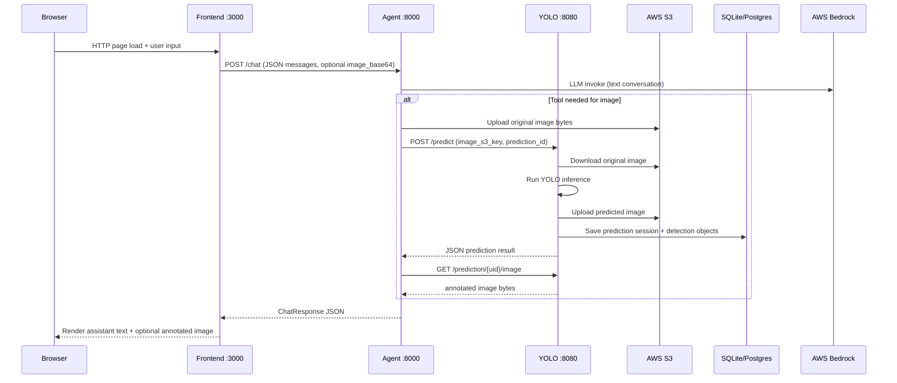
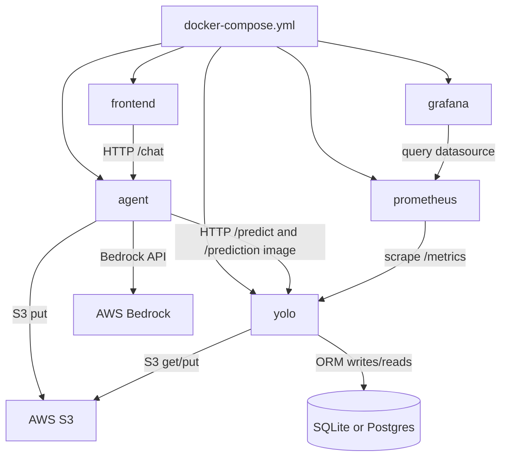
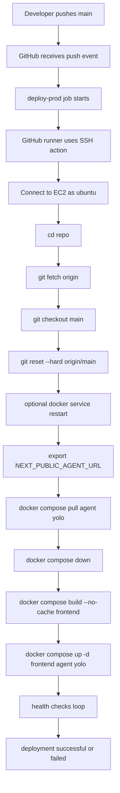

# PolyAI Fursa: Complete System Guide

> Note: This single-file guide is now accompanied by a split documentation set for easier navigation.
> Start with [docs/README.md](README.md) and follow chapters 01 through 18.

This guide teaches the project from scratch using the actual repository contents.

Scope rules used in this guide:
- Included: all non-generated files and directories in the repository.
- Excluded from deep analysis: generated/build/cache folders such as node_modules, .next, htmlcov, coverage outputs, __pycache__, and cache/build artifacts.

---

## Part 1 - Project Overview

### What is this project?
PolyAI Fursa is a multi-service AI application where a user chats in a web UI and can upload an image. The system uses:
- a frontend chat app,
- an agent service that manages conversation and decides when to run tools,
- a YOLO vision service that detects objects,
- AWS S3 for image storage,
- AWS Bedrock for language-model responses,
- Prometheus and Grafana for monitoring.

### What problem does it solve?
It solves image-aware assistant workflows:
- user asks questions,
- user can include an image,
- system detects objects in the image,
- system responds in natural language and can return an annotated image.

### Technologies used
- Frontend: Next.js + React + TypeScript + Tailwind
- Agent backend: FastAPI + LangChain + AWS Bedrock + httpx + boto3
- Vision backend: FastAPI + Ultralytics YOLOv8 + SQLAlchemy + SQLite/Postgres option + boto3
- Containerization: Docker + Docker Compose
- CI/CD: GitHub Actions
- Monitoring: Prometheus + Grafana

### Why these technologies
- FastAPI: simple, fast API development with validation.
- Next.js: modern UI stack with server/client support.
- YOLOv8: ready object detection model.
- LangChain: tool-calling and model integration patterns.
- Docker Compose: easy local/dev/prod multi-container orchestration.
- GitHub Actions + SSH: straightforward deployment automation to EC2.
- Prometheus/Grafana: standard observability stack.

### Major services
- Frontend: user-facing chat app.
- Agent: conversation orchestration and tool calling.
- YOLO: object detection + prediction persistence.
- Prometheus: metric collection from services.
- Grafana: metric dashboards.

### Architecture in one sentence
Browser requests go to Frontend, Frontend calls Agent, Agent calls YOLO when image analysis is needed, YOLO uses S3 and DB, Agent uses Bedrock for language generation, then response returns to Browser.

---

## Part 2 - Complete Folder Tree

Repository tree (non-generated focus, generated shown and marked):

```text
PolyAIFursa-Private/
|-- .agents/
|   |-- skills/
|   |   `-- data-layer/
|   |       |-- SKILL.md
|   |       |-- skill.md
|   |       `-- evals/
|-- .github/
|   `-- workflows/
|       |-- deploy.yaml
|       `-- test.yaml
|-- AGENTS.md
|-- README.md
|-- docker-compose.yml
|-- prometheus.yml
|-- test_bedrock.py
|-- yolov8n.pt
|-- coverage.xml (generated)
|-- htmlcov/ (generated)
|-- uploads/
|   |-- original/
|   `-- predicted/
`-- services/
    |-- frontend/
    |   |-- Dockerfile
    |   |-- package.json
    |   |-- package-lock.json
    |   |-- next.config.mjs
    |   |-- postcss.config.mjs
    |   |-- tailwind.config.ts
    |   |-- tsconfig.json
    |   |-- next-env.d.ts
    |   |-- .dockerignore
    |   |-- .next/ (generated)
    |   |-- node_modules/ (generated)
    |   |-- app/
    |   |   |-- globals.css
    |   |   |-- layout.tsx
    |   |   `-- page.tsx
    |   |-- components/
    |   |   |-- chat.tsx
    |   |   `-- message-bubble.tsx
    |   `-- lib/
    |       |-- api.ts
    |       |-- types.ts
    |       `-- utils.ts
    |-- agent/
    |   |-- Dockerfile
    |   |-- README.md
    |   |-- requirements.txt
    |   |-- app.py
    |   |-- .env
    |   |-- .env.example
    |   |-- .dockerignore
    |   `-- tests/
    |       |-- __init__.py
    |       |-- test_api.py
    |       `-- test_structured_chat.py
    `-- yolo/
        |-- Dockerfile
        |-- README.md
        |-- app.py
        |-- db.py
        |-- models.py
        |-- s3_utils.py
        |-- requirements.txt
        |-- torch-requirements.txt
        |-- pytest.ini
        |-- predictions.db
        |-- yolov8n.pt
        |-- .dockerignore
        |-- coverage.xml (generated)
        |-- htmlcov/ (generated)
        |-- uploads/
        |   |-- original/
        |   `-- predicted/
        `-- tests/
            |-- __init__.py
            |-- data/
            |-- test_api.py
            |-- test_prediction_time.py
            |-- test_predictions_by_label.py
            `-- test_predictions_by_score.py
```

### Folder responsibilities
- .agents: local agent customization/skills metadata.
- .github/workflows: CI and CD automation.
- services/frontend: user interface and browser API caller.
- services/agent: orchestration API and Bedrock tool-calling logic.
- services/yolo: detection API, metrics, and persistence.
- uploads directories: local image file artifacts.
- root config files: compose and monitoring topology.

---

## Part 3 - File-by-File Explanation

This section covers all important non-generated files with execution and dependency context.

### Root-level files

| File | Purpose | Why needed | Used by | If deleted/wrong | Execution timing |
|---|---|---|---|---|---|
| [README.md](../README.md) | Root setup and quick run docs | onboarding and run consistency | humans | setup confusion and wrong run commands | read by developers |
| [AGENTS.md](../AGENTS.md) | repo guidance for coding agent behavior | enforces architecture teaching constraints | AI assistant process | risk of invalid assistant behavior | read during assistant operation |
| [docker-compose.yml](../docker-compose.yml) | multi-service orchestration | defines runtime topology | docker compose | stack will not start consistently | when compose commands run |
| [prometheus.yml](../prometheus.yml) | Prometheus scrape configuration | tells Prometheus what to collect | Prometheus service | no metrics collection | when Prometheus starts/reloads |
| [test_bedrock.py](../test_bedrock.py) | minimal Bedrock connectivity script | smoke test model access | developers | harder to isolate Bedrock issues | manually when run |
| [.gitignore](../.gitignore) | git tracking rules | avoids committing generated/secrets files | git | noisy repo and secret leakage risk | at git add/status time |

### GitHub workflow files

| File | Purpose | Why needed | Used by | If deleted/wrong | Execution timing |
|---|---|---|---|---|---|
| [.github/workflows/deploy.yaml](../.github/workflows/deploy.yaml) | deploy to dev/prod EC2 via SSH | automated deployment | GitHub Actions | no automatic deployment | on push to dev/main |
| [.github/workflows/test.yaml](../.github/workflows/test.yaml) | CI tests and Docker scout scan | quality gate and image checks | GitHub Actions | regressions reach branches | on pull request to main |

### Frontend files

| File | Purpose | Why needed | Imports/Calls | If deleted/wrong | Execution timing |
|---|---|---|---|---|---|
| [services/frontend/Dockerfile](../services/frontend/Dockerfile) | build/run Next app image | containerized frontend deploy | docker compose and CI builds | frontend container cannot build/run | during docker build/run |
| [services/frontend/package.json](../services/frontend/package.json) | scripts and dependencies | npm install/build/start | npm and Docker build | build fails or missing deps | during install/build/start |
| [services/frontend/package-lock.json](../services/frontend/package-lock.json) | deterministic dependency versions | reproducible builds | npm ci | inconsistent dependency behavior | during npm ci |
| [services/frontend/next.config.mjs](../services/frontend/next.config.mjs) | Next.js config entry | centralized framework config | Next runtime/build | config defaults may break expectations | build/start |
| [services/frontend/postcss.config.mjs](../services/frontend/postcss.config.mjs) | PostCSS plugin setup | Tailwind processing | CSS build pipeline | styles break | build time |
| [services/frontend/tailwind.config.ts](../services/frontend/tailwind.config.ts) | design tokens and content scan | utility classes and theme vars | Tailwind build | CSS classes/theme mismatch | build time |
| [services/frontend/tsconfig.json](../services/frontend/tsconfig.json) | TypeScript compiler behavior | type safety and path aliases | tsc/Next | type resolution errors | build/typecheck |
| [services/frontend/next-env.d.ts](../services/frontend/next-env.d.ts) | Next TypeScript ambient types | framework typing support | TypeScript tooling | TS errors | typecheck/build |
| [services/frontend/.dockerignore](../services/frontend/.dockerignore) | excludes files from docker build context | faster/smaller builds | Docker | slower and larger builds | docker build |
| [services/frontend/app/layout.tsx](../services/frontend/app/layout.tsx) | app shell and toaster provider | global UI wrapper | imports globals.css and sonner | UI layout/provider issues | frontend runtime |
| [services/frontend/app/page.tsx](../services/frontend/app/page.tsx) | home route component | main page entry | imports Chat component | no chat page | frontend runtime |
| [services/frontend/app/globals.css](../services/frontend/app/globals.css) | global style tokens and base styling | visual consistency | loaded by layout | default/broken styling | frontend runtime |
| [services/frontend/components/chat.tsx](../services/frontend/components/chat.tsx) | chat UI logic and submit flow | core user interaction | calls sendMessage from api.ts | cannot send messages/images | frontend runtime |
| [services/frontend/components/message-bubble.tsx](../services/frontend/components/message-bubble.tsx) | user/assistant message rendering | displays markdown and images | uses ChatMessage type and cn utility | message display broken | frontend runtime |
| [services/frontend/lib/api.ts](../services/frontend/lib/api.ts) | HTTP client to agent /chat | decouples API calls from UI | called by chat.tsx | request failures or wrong endpoint | frontend runtime |
| [services/frontend/lib/types.ts](../services/frontend/lib/types.ts) | shared chat message interface | consistent data contract | imported by components/api | type inconsistencies | build/runtime dev |
| [services/frontend/lib/utils.ts](../services/frontend/lib/utils.ts) | class merge helper | cleaner conditional classes | imported by message-bubble.tsx | styling utility issues | frontend runtime |

### Agent files

| File | Purpose | Why needed | Imports/Calls | If deleted/wrong | Execution timing |
|---|---|---|---|---|---|
| [services/agent/Dockerfile](../services/agent/Dockerfile) | build/run agent image | deployable backend service | compose/CI | agent container unusable | docker build/run |
| [services/agent/README.md](../services/agent/README.md) | service setup/API docs | developer onboarding | humans | harder maintenance | docs only |
| [services/agent/requirements.txt](../services/agent/requirements.txt) | python dependencies | runtime import availability | pip and Docker build | runtime import errors | install/build |
| [services/agent/.env.example](../services/agent/.env.example) | environment template | safe baseline config | developers | misconfigured env | setup time |
| [services/agent/.dockerignore](../services/agent/.dockerignore) | build context pruning | efficient image build | Docker | slower/larger build context | docker build |
| [services/agent/app.py](../services/agent/app.py) | FastAPI app, ReAct loop, Bedrock+YOLO calls | project orchestration brain | uses FastAPI, LangChain, boto3, httpx | no chat backend | runtime on port 8000 |
| [services/agent/tests/test_api.py](../services/agent/tests/test_api.py) | API contract tests for /health and /chat | prevents schema regressions | pytest | regressions undetected | CI/local test run |
| [services/agent/tests/test_structured_chat.py](../services/agent/tests/test_structured_chat.py) | run_agent/tool-loop behavior tests | validates logic and sanitization | pytest | tool-loop bugs undetected | CI/local test run |
| [services/agent/tests/__init__.py](../services/agent/tests/__init__.py) | test package marker | import/package consistency | pytest/python | minor test discovery issues | test runtime |

### YOLO files

| File | Purpose | Why needed | Imports/Calls | If deleted/wrong | Execution timing |
|---|---|---|---|---|---|
| [services/yolo/Dockerfile](../services/yolo/Dockerfile) | build YOLO API image | deploy detection service | compose/CI | yolo cannot run in containers | docker build/run |
| [services/yolo/README.md](../services/yolo/README.md) | setup and endpoint docs | maintainability | humans | harder onboarding/debug | docs only |
| [services/yolo/requirements.txt](../services/yolo/requirements.txt) | API and runtime deps | ensure imports available | pip and Docker | runtime import failures | install/build |
| [services/yolo/torch-requirements.txt](../services/yolo/torch-requirements.txt) | torch CPU wheel source/deps | stable torch install in CPU env | pip and Docker | YOLO runtime may fail | install/build |
| [services/yolo/pytest.ini](../services/yolo/pytest.ini) | pytest config and coverage options | stable test behavior | pytest | inconsistent test runs | test runtime |
| [services/yolo/.dockerignore](../services/yolo/.dockerignore) | excludes local/test files from build context | faster/smaller image build | Docker | slower builds | docker build |
| [services/yolo/models.py](../services/yolo/models.py) | SQLAlchemy models and relationships | defines DB schema | imported by app.py and db.py | DB ORM broken | service startup/runtime |
| [services/yolo/db.py](../services/yolo/db.py) | engine/session/configurable backend | DB connectivity and session lifecycle | imported by app.py | no database access | service startup/runtime |
| [services/yolo/s3_utils.py](../services/yolo/s3_utils.py) | S3 upload/download helpers | isolated cloud file transfer logic | imported by app.py | cannot move images to/from S3 | runtime on prediction/image fetch |
| [services/yolo/app.py](../services/yolo/app.py) | FastAPI routes, YOLO inference, metrics | core vision service | imports db/models/s3_utils | no detection API | runtime on port 8080 |
| [services/yolo/predictions.db](../services/yolo/predictions.db) | SQLite data file | local persistence | used by SQLAlchemy engine | local historical data lost | runtime when SQLite backend |
| [services/yolo/tests/test_api.py](../services/yolo/tests/test_api.py) | endpoint and error-path tests | API stability | pytest | behavior regressions unnoticed | CI/local test run |
| [services/yolo/tests/test_prediction_time.py](../services/yolo/tests/test_prediction_time.py) | checks processing time field | response contract validation | pytest | timing field regressions unnoticed | CI/local test run |
| [services/yolo/tests/test_predictions_by_label.py](../services/yolo/tests/test_predictions_by_label.py) | label filtering tests | query behavior validation | pytest | label filter regressions unnoticed | CI/local test run |
| [services/yolo/tests/test_predictions_by_score.py](../services/yolo/tests/test_predictions_by_score.py) | score filtering tests | threshold query validation | pytest | score filter regressions unnoticed | CI/local test run |
| [services/yolo/tests/__init__.py](../services/yolo/tests/__init__.py) | test package marker | package consistency | pytest/python | minor discovery issues | test runtime |
| [services/yolo/tests/data](../services/yolo/tests/data) | test assets | realistic test inputs | test files | tests become less representative | test runtime |

### Repository metadata/skill files

| File | Purpose | Why needed | Used by | If deleted/wrong | Execution timing |
|---|---|---|---|---|---|
| [.agents/skills/data-layer/SKILL.md](../.agents/skills/data-layer/SKILL.md) | local skill instructions for data-layer refactors | consistent AI-assisted backend edits | assistant tooling | less consistent future refactors | when assistant invokes skill |
| [.agents/skills/data-layer/skill.md](../.agents/skills/data-layer/skill.md) | auxiliary skill metadata | tooling support | assistant tooling | reduced guidance consistency | assistant usage |

---

## Part 4 - Complete Service Architecture

### Frontend service
- Purpose: user chat interface and image upload entry point.
- Technology: Next.js, React, TypeScript, Tailwind.
- Port mapping: host 3000 -> container 3000.
- Docker source: built from [services/frontend/Dockerfile](../services/frontend/Dockerfile), image tagged in [docker-compose.yml](../docker-compose.yml).
- Environment variables:
  - NEXT_PUBLIC_AGENT_URL
- Networks:
  - polyai-net
- Depends on:
  - agent
- Receives requests from:
  - browser users via HTTP.
- Sends requests to:
  - agent /chat endpoint.
- Exposes API:
  - none for other services; it serves web pages/assets.
- Consumes API:
  - Agent FastAPI endpoints.
- Started/stopped by:
  - docker compose up/down.

### Agent service
- Purpose: orchestrate conversation and tool calls.
- Technology: FastAPI + LangChain + Bedrock SDK integration.
- Port mapping: host 8000 -> container 8000.
- Docker source: image rinaahmd/agent-service:0.0.1 from [docker-compose.yml](../docker-compose.yml).
- Environment variables:
  - YOLO_SERVICE_URL
  - MODEL
  - AWS_REGION
  - AWS_S3_BUCKET
- Volumes:
  - ~/.aws mounted read-only to /root/.aws
- Networks:
  - polyai-net
- Depends on:
  - yolo
- Receives requests from:
  - frontend/browser to /chat and /health.
- Sends requests to:
  - yolo /predict and /prediction/{uid}/image,
  - AWS Bedrock via LangChain,
  - AWS S3 via boto3 upload.
- Exposes API:
  - POST /chat
  - GET /health
- Started/stopped by:
  - docker compose up/down.

### YOLO service
- Purpose: image detection, annotation, prediction persistence, query endpoints.
- Technology: FastAPI + Ultralytics YOLO + SQLAlchemy + Prometheus instrumentation.
- Port mapping: host 8080 -> container 8080.
- Docker source: image rinaahmd/yolo-service:0.0.1 in [docker-compose.yml](../docker-compose.yml).
- Environment variables:
  - AWS_REGION
  - AWS_S3_BUCKET
  - CONFIDENCE_THRESHOLD optional
  - DB_* optional variables read by db.py
- Volumes:
  - ~/.aws mounted read-only to /root/.aws
- Networks:
  - polyai-net
- Receives requests from:
  - agent and optional direct clients.
- Sends requests to:
  - AWS S3 for download/upload of images,
  - local database engine via SQLAlchemy.
- Exposes API:
  - /health, /ready, /RINA, /predict, prediction query endpoints, /metrics.
- Started/stopped by:
  - docker compose up/down.

### Prometheus service
- Purpose: scrape and store metrics.
- Technology: prom/prometheus image.
- Port mapping: host 9090 -> container 9090.
- Config file:
  - [prometheus.yml](../prometheus.yml) mounted to /etc/prometheus/prometheus.yml.
- Networks:
  - monitoring-net and polyai-net.
- Depends on:
  - yolo.
- Receives requests from:
  - browser/users on 9090 UI.
- Sends requests to:
  - yolo:8080 metrics endpoint.
- Started/stopped by:
  - docker compose up/down.

### Grafana service
- Purpose: dashboards on top of Prometheus data.
- Technology: grafana/grafana image.
- Port mapping: host 3001 -> container 3000.
- Volume:
  - grafana-data persisted at /var/lib/grafana.
- Networks:
  - monitoring-net.
- Depends on:
  - prometheus.
- Receives requests from:
  - browser/users on 3001.
- Sends requests to:
  - Prometheus as data source (configured in Grafana UI).
- Started/stopped by:
  - docker compose up/down.

---

## Part 5 - Request Flow

### End-to-end sequence diagram



### Arrow-by-arrow explanation

1. Browser -> Frontend
- Protocol: HTTP
- Port: 3000
- Data: page requests, JS app interactions
- Response: rendered chat UI

2. Frontend -> Agent
- Protocol: HTTP JSON
- Port: 8000
- Endpoint: POST /chat
- Data: messages list, optional image_base64
- Response: response text + metadata + optional annotated image base64

3. Agent -> Bedrock
- Protocol: AWS API call through LangChain/boto integration
- Port: managed by AWS SDK
- Data: text messages and tool context
- Response: model message with optional tool calls

4. Agent -> S3
- Protocol: AWS S3 API
- Data: original image bytes
- Response: object stored under chat/prediction/original key

5. Agent -> YOLO /predict
- Protocol: HTTP JSON
- Port: 8080 internal docker network
- Data: image_s3_key and prediction_id
- Response: prediction_uid, labels, detection_count, time_took

6. YOLO -> S3 (download)
- Gets image by key for inference.

7. YOLO local inference
- Runs model on CPU and creates annotated output image.

8. YOLO -> S3 (upload)
- Stores predicted image key.

9. YOLO -> DB
- Persists prediction session row and detection object rows.

10. Agent -> YOLO /prediction/{uid}/image
- Fetches annotated image bytes and converts to base64.

11. Agent -> Frontend -> Browser
- Returns ChatResponse; UI renders text and optional annotated image.

---

## Part 6 - Docker

### Docker concepts in this repository
- Dockerfile: recipe to build an image.
- Image: built artifact with app code and dependencies.
- Container: running instance of image.
- Build: creates image from Dockerfile context.
- Run: starts container process.
- Volume: persistent/shared storage mount.
- Network: container communication layer.
- Bridge network: Docker virtual network for inter-container routing.
- Port mapping: host_port:container_port.
- Build args: values used at image build time.
- Environment variables: runtime configuration values.
- depends_on: startup ordering hint.

### Compose line-by-line explanation
Reference file: [docker-compose.yml](../docker-compose.yml)

- services: root section listing containers to run together.
- frontend:
  - build.context: uses services/frontend as build context.
  - build.args.NEXT_PUBLIC_AGENT_URL: injected during image build.
  - image: tag name for built image.
  - environment.NEXT_PUBLIC_AGENT_URL: runtime env passed to container.
  - ports 3000:3000: frontend reachable at host 3000.
  - networks polyai-net: can talk to agent by service name.
  - depends_on agent: frontend starts after agent creation begins.
- agent:
  - image rinaahmd/agent-service:0.0.1: prebuilt image pulled.
  - ports 8000:8000: API available at host 8000.
  - environment:
    - YOLO_SERVICE_URL=http://yolo:8080 for internal DNS routing.
    - MODEL, AWS_REGION, AWS_S3_BUCKET for Bedrock/S3 setup.
  - volumes ~/.aws:/root/.aws:ro gives AWS credentials read-only.
  - networks polyai-net for frontend and yolo communication.
  - depends_on yolo startup ordering.
- yolo:
  - image rinaahmd/yolo-service:0.0.1.
  - ports 8080:8080.
  - environment AWS_REGION and AWS_S3_BUCKET.
  - volumes ~/.aws mount for AWS auth.
  - networks polyai-net.
- prometheus:
  - image prom/prometheus.
  - ports 9090:9090.
  - volumes:
    - mount [prometheus.yml](../prometheus.yml) into container config path.
    - named volume prometheus-data for persistence.
  - networks monitoring-net and polyai-net.
  - depends_on yolo.
- grafana:
  - image grafana/grafana.
  - ports 3001:3000 avoids conflict with frontend host 3000.
  - volume grafana-data persisted.
  - network monitoring-net only.
  - depends_on prometheus.
- networks:
  - polyai-net bridge for app services.
  - monitoring-net bridge for monitor stack.
- volumes:
  - grafana-data and prometheus-data named persistent volumes.

### Why frontend uses NEXT_PUBLIC_AGENT_URL
Frontend runs in browser context, and browser cannot resolve Docker-internal hostnames like agent. It needs a browser-reachable URL, for example:
- local compose: http://localhost:8000
- remote EC2 deployment: http://public-ip:8000

### Why agent uses YOLO_SERVICE_URL=http://yolo:8080
Agent runs inside Docker on same network as YOLO, so internal DNS resolves yolo to the YOLO container IP. This is stable and avoids hard-coded changing IPs.

### Why Docker can use service name instead of IP
Docker Compose creates an internal DNS server on the network. Service names become hostnames automatically.

### What happens after docker compose up
1. Compose parses [docker-compose.yml](../docker-compose.yml).
2. Creates networks and named volumes if missing.
3. Pulls prebuilt images where needed.
4. Builds frontend image from Dockerfile.
5. Creates containers with env vars, mounts, ports.
6. Starts containers respecting depends_on order.
7. Services initialize internally (apps bind to ports).
8. You can access:
   - Frontend: http://localhost:3000
   - Agent: http://localhost:8000
   - YOLO: http://localhost:8080
   - Prometheus: http://localhost:9090
   - Grafana: http://localhost:3001

---

## Part 7 - GitHub Actions

### Deploy workflow line-by-line
Reference: [.github/workflows/deploy.yaml](../.github/workflows/deploy.yaml)

- name: Deploy Services -> workflow label.
- on.push.branches main/dev -> trigger on pushes to these branches.
- permissions.contents read -> minimal repo read permission.

Jobs:
- deploy-dev:
  - if github.ref == refs/heads/dev -> only run for dev branch.
  - runs-on ubuntu-latest.
  - step uses appleboy/ssh-action@v1:
    - connects to host from DEV_INSTANCE_IP secret,
    - username ubuntu,
    - SSH private key from DEV_INSTANCE_SSH_KEY secret,
    - executes remote shell script.

- deploy-prod:
  - same structure, but branch main and PROD_* secrets.

Remote script purpose:
1. set -e: fail fast on command errors.
2. cd project path on EC2.
3. git fetch origin: get latest remote refs.
4. git checkout branch: ensure target branch active.
5. git reset --hard origin/branch: make working tree exactly match remote branch tip.
6. optional docker daemon restart check via systemctl.
7. export NEXT_PUBLIC_AGENT_URL to branch-specific public IP.
8. docker compose pull agent yolo: get latest backend images.
9. docker compose down: stop existing stack.
10. docker compose build --no-cache frontend: rebuild frontend so build arg is baked in.
11. docker compose up -d frontend agent yolo: start target services in detached mode.
12. docker compose ps: show container status.
13. wait_for_service function loops curl checks for readiness URLs.

### Why git fetch / checkout / reset
- fetch: update local knowledge of remote commits.
- checkout: select correct deployment branch.
- reset --hard: remove drift on server and force exact deploy version.

### Why compose pull/down/build/up
- pull: refresh prebuilt images.
- down: stop and remove old containers/network attachments cleanly.
- build frontend: inject latest NEXT_PUBLIC_AGENT_URL at build time.
- up: start fresh containers.

### Health checks in workflow
- yolo: curl http://localhost:8080/health
- agent: curl http://localhost:8000/health
- frontend: curl http://localhost:3000
If retries exceed 60, job fails.

### What happens after merge to main
Assuming merge triggers push event on main:
1. deploy-prod job runs.
2. GitHub runner SSHes to production EC2.
3. Remote script resets repo to origin/main.
4. Docker stack is refreshed.
5. Health checks pass or deployment fails.

---

## Part 8 - Git Workflow

Recommended workflow for this repo:

```text
feature branch
-> commit
-> push
-> pull request
-> CI tests and scans
-> merge to dev
-> deploy-dev workflow
-> validate in dev
-> merge to main
-> deploy-prod workflow
```

Why each step exists:
- Feature branch: isolated change set.
- Commit: atomic history and rollback points.
- Push: share changes with remote.
- PR: review and quality discussion.
- CI: automated regression/security checks.
- Merge to dev: environment-level integration.
- Deploy dev: realistic validation before prod.
- Merge to main: release approval.
- Deploy prod: customer-facing rollout.

---

## Part 9 - AWS

### AWS services used
- EC2: deployment targets inferred from SSH workflow and remote path.
- Elastic/Public IPs: used in NEXT_PUBLIC_AGENT_URL values in deploy scripts.
- Security Groups: must allow inbound ports used by services.
- S3: image storage for original and predicted images.
- Bedrock: language model used by agent via MODEL and AWS_REGION.

### Credentials and ~/.aws mount
Compose mounts host ~/.aws into containers:
- agent and yolo get /root/.aws read-only.
- boto3 reads credentials and config from this path.

### Ports likely required on EC2 security group
Based on exposed services:
- 22 for SSH (required for deployment action)
- 3000 frontend
- 8000 agent
- 8080 yolo (if publicly exposed)
- 9090 prometheus (if public)
- 3001 grafana (if public)

### Which service uses what
- Frontend: no direct AWS SDK usage.
- Agent: Bedrock and S3.
- YOLO: S3.
- Prometheus/Grafana: no AWS dependency in current repo.

---

## Part 10 - Monitoring

### Prometheus
- Config source: [prometheus.yml](../prometheus.yml)
- Scrape interval: 15s.
- Job target: yolo:8080.

### Metrics collected
YOLO app exposes metrics via prometheus-fastapi-instrumentator:
- request counts,
- latency/histograms,
- in-progress/request status style metrics,
- process/runtime metrics depending on defaults.

### Grafana
- Runs on host 3001 mapped to container 3000.
- Uses Prometheus as data source (configured in Grafana UI).
- Stores dashboard/config state in grafana-data volume.

### Connection relationships
- Prometheus -> YOLO: scrape HTTP endpoint on internal network.
- Grafana -> Prometheus: query metrics for dashboard panels.

Why Grafana is on 3001 not 3000:
- Frontend already uses host 3000.
- 3001 avoids collision.

---

## Part 11 - Database

### Database stack
- ORM: SQLAlchemy.
- Default backend: SQLite file via DB_PATH.
- Optional backend: Postgres when DB_BACKEND=postgres.

### Key files
- [services/yolo/db.py](../services/yolo/db.py): engine/session config.
- [services/yolo/models.py](../services/yolo/models.py): model definitions.
- [services/yolo/app.py](../services/yolo/app.py): reads/writes rows.

### Models and relationship
- PredictionSession table:
  - uid primary key,
  - timestamp,
  - original_image key/path,
  - predicted_image key/path.
- DetectionObject table:
  - id primary key,
  - prediction_uid foreign key -> PredictionSession.uid,
  - label,
  - score,
  - box coordinates.
- Relationship:
  - one PredictionSession has many DetectionObject rows.

### Persistence flow
1. /predict called with image_s3_key and prediction_id.
2. YOLO downloads image from S3.
3. YOLO inference runs.
4. Annotated image uploaded back to S3.
5. Session row inserted.
6. Detection rows inserted.
7. Commit persists transaction.

---

## Part 12 - API Documentation

### Agent API

1. POST /chat
- Service: agent
- Input:
  - messages: list of objects with role, content, optional image_base64
  - chat_id optional
- Output:
  - response text,
  - prediction_id nullable,
  - annotated_image nullable base64,
  - agent_loop_time_s,
  - iterations,
  - tools_called,
  - context_limit_exceeded,
  - tokens_used object
- Status:
  - 200 success
  - 422 validation error
- Called by:
  - frontend lib/api.ts
- Curl example:

```bash
curl -X POST http://localhost:8000/chat \
  -H "Content-Type: application/json" \
  -d '{"messages":[{"role":"user","content":"Describe this"}]}'
```

2. GET /health
- Service: agent
- Output: status ok
- Called by:
  - deploy workflow health check,
  - operators
- Curl:

```bash
curl http://localhost:8000/health
```

### YOLO API

1. GET /health
- Output: status ok
- Used by deploy checks.

2. GET /RINA
- Output: status ok
- Utility test endpoint.

3. GET /ready
- Output:
  - 200 ready
  - 503 when shutting down

4. POST /predict
- Input JSON:
  - image_s3_key
  - prediction_id
- Output JSON:
  - prediction_uid
  - detection_count
  - labels array
  - time_took
- Called by:
  - agent detect_objects tool
- Status examples:
  - 200 success
  - 400 invalid key/content
  - 502 S3 transfer failure
  - 503 S3 config failure

5. GET /prediction/{uid}
- Output:
  - session metadata and detection_objects list
- Status:
  - 200 found
  - 404 not found

6. GET /prediction/{uid}/image
- Output: image file bytes
- Status:
  - 200 image
  - 404 not found
  - 503 S3 config error

7. GET /predictions/score/{min_score}
- Output: list of detection objects with score >= min_score
- Status:
  - 200 list
  - 400 invalid score bounds

8. GET /predictions/label/
- Output: 400 label cannot be empty

9. GET /predictions/label/{label}
- Output: predictions containing that label
- Status:
  - 200 list
  - 400 empty label

10. GET /metrics
- Output: Prometheus text metrics
- Called by:
  - Prometheus scrape job

YOLO curl examples:

```bash
curl http://localhost:8080/health
curl http://localhost:8080/ready
curl -X POST http://localhost:8080/predict -H "Content-Type: application/json" -d '{"image_s3_key":"chat/demo/original/beatles.jpeg","prediction_id":"demo-123"}'
curl http://localhost:8080/prediction/demo-123
curl http://localhost:8080/prediction/demo-123/image --output annotated.jpg
curl http://localhost:8080/predictions/score/0.5
curl http://localhost:8080/predictions/label/person
curl http://localhost:8080/metrics
```

---

## Part 13 - Environment Variables

| Variable | Defined where | Read where | Service | Example | Why needed | If wrong |
|---|---|---|---|---|---|---|
| NEXT_PUBLIC_AGENT_URL | compose build args and env, deploy workflow export | [services/frontend/lib/api.ts](../services/frontend/lib/api.ts) and Dockerfile build/runtime | frontend | http://localhost:8000 | browser API base URL | frontend calls wrong/unreachable backend |
| YOLO_SERVICE_URL | compose env, agent env files | [services/agent/app.py](../services/agent/app.py) | agent | http://yolo:8080 | agent -> yolo endpoint routing | tool calls fail |
| MODEL | compose/env.example | [services/agent/app.py](../services/agent/app.py) | agent | amazon.nova-micro-v1:0 | selects Bedrock model | model init fails or unexpected model |
| AWS_REGION | compose/env/example | [services/agent/app.py](../services/agent/app.py), [services/yolo/s3_utils.py](../services/yolo/s3_utils.py) | agent,yolo | us-east-1 | AWS client region selection | AWS API failures |
| AWS_S3_BUCKET | compose/env/example | [services/agent/app.py](../services/agent/app.py), [services/yolo/s3_utils.py](../services/yolo/s3_utils.py) | agent,yolo | rina-polyai-images | image object storage bucket | upload/download failures |
| CONFIDENCE_THRESHOLD | runtime env optional | [services/yolo/app.py](../services/yolo/app.py) | yolo | 0.5 | detection score filter | too many/few detections or parse error |
| DB_BACKEND | runtime env optional | [services/yolo/db.py](../services/yolo/db.py) | yolo | sqlite or postgres | choose DB backend | wrong backend URL errors |
| DB_PATH | runtime env optional | [services/yolo/db.py](../services/yolo/db.py) | yolo | predictions.db | sqlite file path | DB file issues/no persistence |
| DB_USER | runtime env optional | [services/yolo/db.py](../services/yolo/db.py) | yolo | postgres | postgres auth | connection/auth failures |
| DB_PASSWORD | runtime env optional | [services/yolo/db.py](../services/yolo/db.py) | yolo | secret | postgres auth | connection/auth failures |
| DB_HOST | runtime env optional | [services/yolo/db.py](../services/yolo/db.py) | yolo | localhost | postgres host | connection failures |
| DB_NAME | runtime env optional | [services/yolo/db.py](../services/yolo/db.py) | yolo | predictions | postgres db name | connection failures |

GitHub secrets used in workflows:
- DEV_INSTANCE_IP
- DEV_INSTANCE_SSH_KEY
- PROD_INSTANCE_IP
- PROD_INSTANCE_SSH_KEY
- CODECOV_TOKEN
- DOCKERHUB_USERNAME
- DOCKERHUB_TOKEN

---

## Part 14 - Connection Map

### Service dependency map



### Addressing model explained
- Docker internal DNS:
  - inside containers, yolo resolves by service name.
- localhost:
  - in browser means user machine.
  - in container means that container itself.
- Container names:
  - used for inter-service calls on same Docker network.
- Public/Elastic IP:
  - used by browsers outside Docker host.

Why hostnames vs public IP:
- Service-to-service inside Docker: use service names.
- Browser-to-service from outside host: use public IP or localhost mapping.

---

## Part 15 - Deployment Timeline

After running git push origin main:



Timeline notes:
- This workflow ensures deterministic server state and reproducible container rollout.
- Health checks are gating conditions before workflow success.

---

## Part 16 - Debugging

### Core commands

Check running containers:

```bash
docker compose ps
```

View logs for all services:

```bash
docker compose logs -f
```

View logs for one service:

```bash
docker compose logs -f frontend
docker compose logs -f agent
docker compose logs -f yolo
docker compose logs -f prometheus
docker compose logs -f grafana
```

Open shell in container:

```bash
docker compose exec agent sh
docker compose exec yolo sh
```

List images/networks/volumes:

```bash
docker images
docker network ls
docker volume ls
```

Health checks:

```bash
curl http://localhost:8000/health
curl http://localhost:8080/health
curl http://localhost:8080/ready
curl http://localhost:9090/-/healthy
```

Service URLs:
- Frontend: http://localhost:3000
- Agent: http://localhost:8000
- YOLO: http://localhost:8080
- Prometheus: http://localhost:9090
- Grafana: http://localhost:3001

### Common deployment failures and fixes

1. Frontend cannot reach agent
- Symptom: chat requests fail in browser.
- Check NEXT_PUBLIC_AGENT_URL in built frontend image and deployment export.
- Fix: rebuild frontend with correct build arg and redeploy.

2. Agent cannot reach YOLO
- Symptom: tool call errors.
- Check YOLO_SERVICE_URL.
- Fix: inside compose use http://yolo:8080.

3. AWS credential errors
- Symptom: S3 or Bedrock failures.
- Check ~/.aws mount and IAM permissions.
- Fix: validate credentials/config on host and mount path.

4. Health checks timeout in workflow
- Symptom: deploy job fails.
- Check remote docker compose logs for failing service startup.
- Fix: correct env vars, image tags, network access, or dependency startup issues.

5. Prometheus has no data
- Symptom: Grafana empty dashboards.
- Check Prometheus targets page and yolo /metrics endpoint.
- Fix: verify network connectivity and scrape config.

---

## Part 17 - Glossary

- Container: a running isolated process based on an image.
- Image: a packaged application filesystem and startup config.
- Dockerfile: instructions to build an image.
- Compose: tool to run many containers together from one YAML.
- Workflow: automation pipeline file in GitHub Actions.
- Job: one execution unit inside a workflow.
- Step: one action/command inside a job.
- Service: named container configuration in compose.
- Volume: persistent storage mount for containers.
- Network: communication layer connecting containers.
- Port: numbered network endpoint.
- HTTP: web protocol used by APIs.
- API: contract for one service talking to another.
- Endpoint: specific API URL and method.
- FastAPI: Python framework for web APIs.
- Next.js: React framework for web apps.
- React: UI library for components.
- Bridge network: Docker private network with DNS/routing.
- SSH: secure remote shell connection.
- EC2: AWS virtual machine.
- Elastic IP: static public IP for cloud hosts.
- S3: AWS object storage service.
- Bedrock: AWS managed foundation model platform.
- Prometheus: metrics scraping and storage system.
- Grafana: dashboard and visualization tool.
- SQLite: file-based relational database.
- SQLAlchemy: Python ORM for SQL databases.

---

## Part 18 - Interview Preparation

### How to present this project in 60 seconds
I built a containerized AI assistant platform with a React/Next frontend, a FastAPI agent backend that uses Bedrock and tool-calling, and a YOLO FastAPI microservice for object detection. The services are orchestrated by Docker Compose, deployed via GitHub Actions over SSH to EC2, and observed using Prometheus and Grafana. Images are stored in S3, and predictions are persisted with SQLAlchemy using SQLite by default.

### Why each technology was chosen
- Next.js/React: fast UI development and modern DX.
- FastAPI: type-safe, high-velocity backend APIs.
- YOLOv8: reliable object detection model integration.
- LangChain: tool-calling orchestration around LLM.
- Docker Compose: reproducible local and server environments.
- GitHub Actions: branch-driven CI/CD automation.
- Prometheus/Grafana: low-friction observability.

### Common interview questions and concise answers
1. Why split agent and yolo services?
- Separation of concerns: language orchestration and computer vision scale differently and can be deployed/updated independently.

2. Why not call YOLO directly from frontend?
- Security and architecture: backend controls credentials, data flow, validation, and AI orchestration.

3. Why does frontend need build-time URL config?
- Browser bundle embeds NEXT_PUBLIC_* variables during build.

4. Why use reset --hard in deployment?
- To guarantee exact server code state equals remote branch, removing drift.

5. How do you monitor service health?
- Deploy health curls, Prometheus scrape metrics from YOLO, Grafana dashboards for operational visibility.

6. What are top failure points?
- Incorrect env vars, missing AWS credentials, container networking mistakes, and failed health checks.

---

## Part 19 - Teach Me Framework

Use this checklist to explain any major component to another engineer.

### Template
1. What it is
- Define the component in one sentence.
2. Why we use it
- Explain the practical reason in this architecture.
3. What problem it solves
- Name the pain point it removes.
4. Alternatives
- Mention at least one realistic alternative.
5. What if removed
- Describe concrete impact on this repo.
6. How to explain it simply
- Give a plain-English one-liner.

### Example: Agent service
1. What it is
- A FastAPI orchestration service that talks to Bedrock and tools.
2. Why we use it
- Central place for conversation logic and tool decisions.
3. Problem solved
- Keeps frontend simple and prevents direct access to cloud/tool internals.
4. Alternatives
- Monolith frontend+backend process, or serverless functions.
5. If removed
- No chat intelligence, no tool-calling pipeline.
6. Simple explanation
- It is the brain that decides when to ask the vision service for help.

### Example: Prometheus
1. What it is
- A metrics collector.
2. Why we use it
- To track service behavior over time.
3. Problem solved
- Replaces guesswork during outages.
4. Alternatives
- CloudWatch, Datadog, OpenTelemetry backends.
5. If removed
- Harder incident diagnosis and trend analysis.
6. Simple explanation
- It continuously records how healthy and busy our APIs are.

---

## Appendix A - Source References

Core architecture and runtime files:
- [docker-compose.yml](../docker-compose.yml)
- [prometheus.yml](../prometheus.yml)
- [services/agent/app.py](../services/agent/app.py)
- [services/yolo/app.py](../services/yolo/app.py)
- [services/frontend/components/chat.tsx](../services/frontend/components/chat.tsx)
- [services/frontend/lib/api.ts](../services/frontend/lib/api.ts)

Deployment and CI:
- [.github/workflows/deploy.yaml](../.github/workflows/deploy.yaml)
- [.github/workflows/test.yaml](../.github/workflows/test.yaml)

Data layer:
- [services/yolo/db.py](../services/yolo/db.py)
- [services/yolo/models.py](../services/yolo/models.py)
- [services/yolo/s3_utils.py](../services/yolo/s3_utils.py)

Documentation and setup:
- [README.md](../README.md)
- [services/agent/README.md](../services/agent/README.md)
- [services/yolo/README.md](../services/yolo/README.md)

---

## Appendix B - Quick Start Learning Path

1. Read [docker-compose.yml](../docker-compose.yml) to understand the topology.
2. Read [services/frontend/components/chat.tsx](../services/frontend/components/chat.tsx) to see user request creation.
3. Read [services/agent/app.py](../services/agent/app.py) to understand orchestration and tool-calling.
4. Read [services/yolo/app.py](../services/yolo/app.py) to understand vision processing and persistence.
5. Read [.github/workflows/deploy.yaml](../.github/workflows/deploy.yaml) to understand production rollout.
6. Open Prometheus and Grafana after running the stack to observe runtime behavior.
